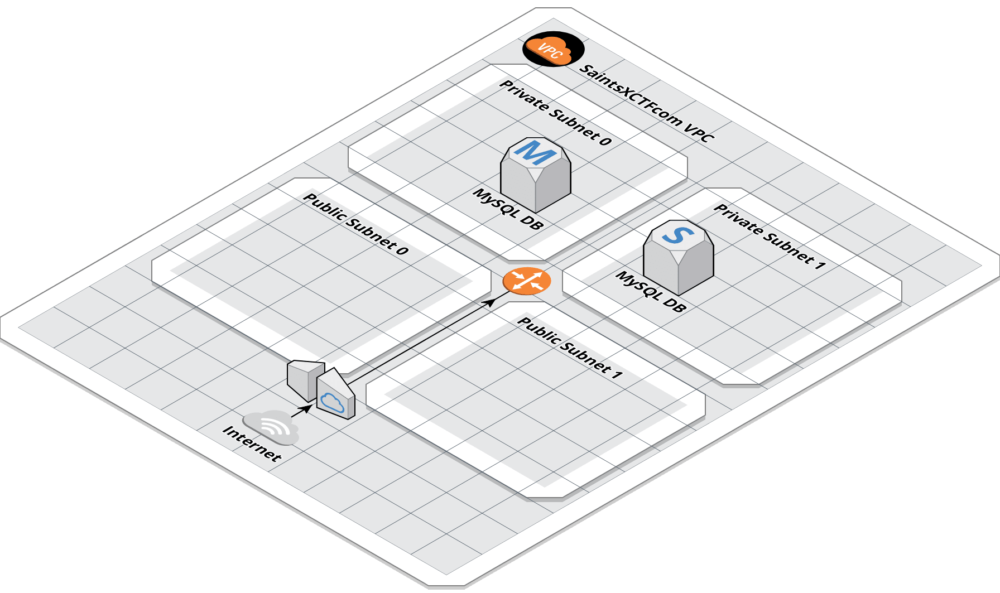

# saints-xctf-infrastructure

### Overview

This repository holds application specific infrastructure for the [saintsxctf.com](https://www.saintsxctf.com/) website.  The 
VPCs for SaintsXCTF.com are configured in the [global-aws-infrastructure](https://github.com/AJarombek/global-aws-infrastructure) 
repository.

### Infrastructure Diagram

*Last Updated: Feb 10th, 2019*

### Directories

| Directory Name    | Description                                                                 |
|-------------------|-----------------------------------------------------------------------------|
| `database`        | Infrastructure for the SaintsXCTF MySQL database.                           |
| `web-server`      | Infrastructure for the SaintsXCTF Web Server.                               |
| `web-app`         | Setup for the websites application code.                                    |
| `route53`         | Configures the DNS records for the application.                             |
| `iam`             | IAM policies used in the SaintsXCTF VPC.                                    |
| `bastion`         | Bastion host for connecting to resources in the private subnets.            |
| `0x18`            | 24th                                                                        |